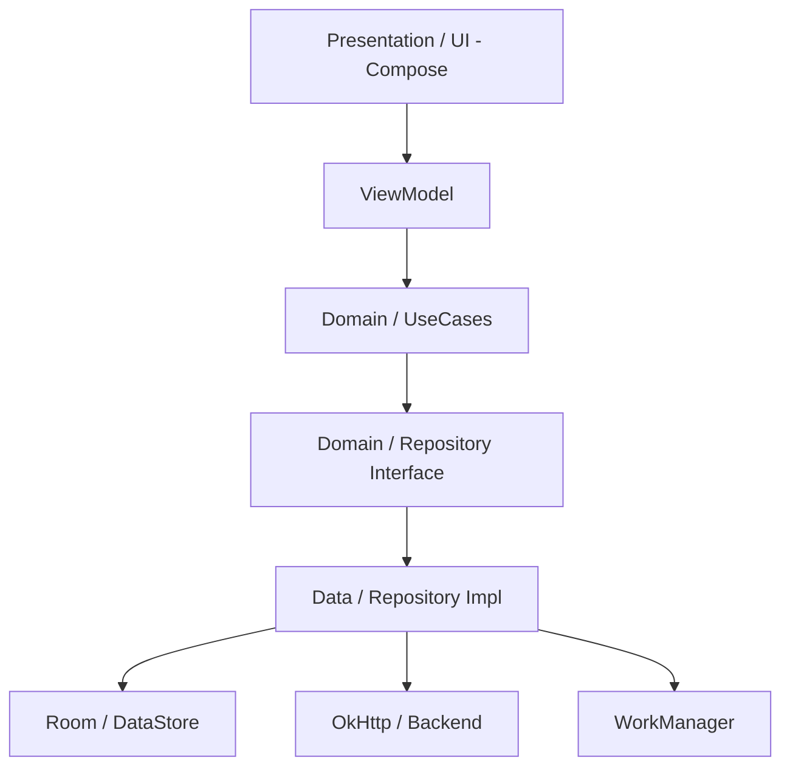
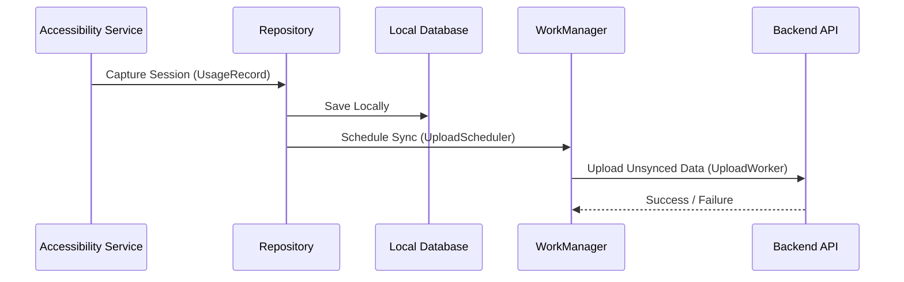
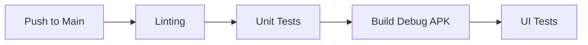

# Stop Scrolling

[](http://kotlinlang.org)
[](https://developer.android.com/jetpack/compose)
[](https://www.android.com)
[](LICENSE)

## 📱 App Overview
**Stop Scrolling** is a digital wellbeing Android application designed to help users monitor and manage their screen time. By capturing usage patterns—including browser URLs and idle detection—the app provides a comprehensive view of digital habits, synchronized across all your devices.

- **Target Users**: Individuals seeking to reduce mindless scrolling and improve digital productivity.
- **Primary Use Case**: Tracking real-time app usage and web browsing activity with automatic backend synchronization for multi-device visibility.

## ✨ Key Features
- 🔍 **Enhanced Tracking**: Accessibility-based monitoring to capture browser URLs and active window titles.
- ⏳ **Idle Detection**: Automatic session finalization when inactivity thresholds are reached.
- ☁️ **Cloud Sync**: Seamless background synchronization of usage data to a custom backend.
- 📱 **Multi-Device Support**: View usage statistics from all your registered devices in one place.
- 📊 **CSV Export**: Export your usage data for local analysis.
- 🛠️ **Connectivity Testing**: Built-in tools to verify backend reachability and status.

## 📸 Screenshots
| Dashboard | Timeline | Settings |
| :---: | :---: | :---: |
|  |  |  |

## 🎥 Demo
> [!TIP]
> A demo video showing the Accessibility Service setup and real-time tracking will be placed here.

---

## 🏗️ Architecture Overview
The project follows **Clean Architecture** principles combined with the **MVVM (Model-View-ViewModel)** pattern to ensure a scalable, maintainable, and testable codebase.

### High-level Architecture


### Project Structure
```text
app/src/main/java/com/example/stopscrolling_android/
├── accessibility/   # AccessibilityService implementation for usage tracking
├── data/            # Data sources (Database, API, Preferences, Repositories)
│   ├── database/    # Room entities and DAOs
│   ├── remote/      # OkHttp clients and API DTOs
│   ├── sync/        # Sync logic and services
│   └── settings/    # DataStore settings management
├── domain/          # Business logic and Repository interfaces
├── presentation/    # UI Layer (Compose screens and ViewModels)
├── worker/          # WorkManager background tasks (Sync, Collection)
└── startup/         # App initialization logic
```

### Data Flow


---

## 🛠️ Technology Stack
| Layer | Technology |
| :--- | :--- |
| **Language** | Kotlin |
| **UI Framework** | Jetpack Compose |
| **DI** | Hilt (Dagger) |
| **Local Storage** | Room, DataStore, Security Crypto |
| **Networking** | OkHttp, Kotlinx Serialization |
| **Background Tasks** | WorkManager |
| **Architecture** | MVVM + Clean Architecture |
| **Minimum SDK** | 24 (Android 7.0) |
| **Target SDK** | 35 (Android 15) |

---

## 🚀 Getting Started

### Prerequisites
- **Android Studio**: Ladybug (2024.2.1) or newer
- **JDK**: Version 17
- **Android SDK**: API Level 35

### Step-by-step Setup
1. **Clone the repository**:
   ```bash
   git clone https://github.com/your-username/stopscrolling-android.git
   cd stopscrolling-android
   ```

2. **Configure local.properties**:
   The app uses a custom backend. Ensure you have your API base URL ready.

3. **Sync Gradle**:
   Open the project in Android Studio and perform a "Gradle Sync".

4. **Run the app**:
   Select your device/emulator and click **Run**.

### Environment Configuration
The app retrieves its configuration primarily through the Settings screen, but default values can be configured in the code or via `local.properties` if added:
```properties
API_BASE_URL=https://api.your-backend.com
```

---

## 🏗️ Build Instructions
Use the following Gradle commands for building and testing:

```bash
# Build Debug APK
./gradlew assembleDebug

# Run Unit Tests
./gradlew test

# Run UI Tests
./gradlew connectedAndroidTest

# Static Analysis (Lint)
./gradlew lint
```

---

## 🧪 Testing Strategy
- **Unit Tests**: Located in `src/test`, covering repository logic, viewmodels, and mapping.
- **Integration Tests**: Testing Room database interactions and API parsing.
- **UI Tests**: Compose-based tests using `JUnit4` and `Espresso`.

### CI/CD Workflow


---

## 🔋 Performance & Optimization
- **Offline First**: All data is saved to Room first, ensuring the app works perfectly without internet.
- **Network Efficiency**: Background uploads are debounced (5s) and only run when a network connection is available.
- **Battery Optimization**: Uses `WorkManager` to batch uploads and respect system-level power constraints.

## 🔐 Security Considerations
- **Secure Storage**: Sensitive information like auth tokens are stored using `EncryptedSharedPreferences`.
- **Privacy**: Only captures window titles and URLs when "Enhanced Tracking" is enabled by the user.
- **Obfuscation**: R8 is enabled in release builds to protect the codebase.

## 🛠️ Troubleshooting
- **Accessibility Service won't start**: Ensure "Stop Scrolling" is enabled in Android Settings > Accessibility.
- **Sync failing**: Check the "Test Connection" tool in Settings to verify your API Base URL is reachable.

---

## 🤝 Contributing
1. Fork the Project
2. Create your Feature Branch (`git checkout -b feature/AmazingFeature`)
3. Commit your Changes (`git commit -m 'Add some AmazingFeature'`)
4. Push to the Branch (`git push origin feature/AmazingFeature`)
5. Open a Pull Request

---

## 🗺️ Roadmap
- [ ] Add Weekly/Monthly usage reports.
- [ ] Implement app blocking features.
- [ ] Support for more browsers (Firefox, Brave).
- [ ] Dark mode refinements.

## 📄 License
Distributed under the MIT License. See `LICENSE` for more information.

## 📧 Contact
Project Link: [https://github.com/your-username/stopscrolling-android](https://github.com/your-username/stopscrolling-android)
